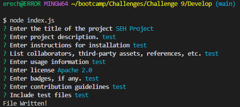

# README Generator

## Description

This is the code to generate a README file using node.js. 

## Installation

Use npm to install inquire.

## Usage

Clone this GitHub repository and run index.js with node. 
Answer the questions to create your own personal README.md

